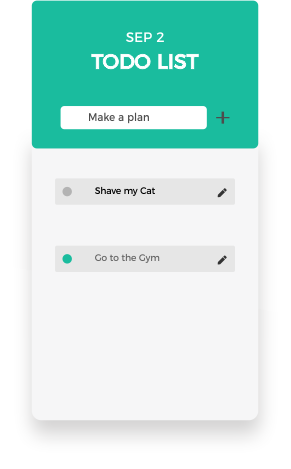

*This challenge was done with basic understanding of HTML,CSS and JAVASCRIPT.**

Users should be able to:

- View the optimal layout for the site depending on their device's screen size

- Add Todos

- Edit existing todos

- Toggle completed todos

- Delete todos

- See hover states for all interactive elements on the page

Styles Used

Font- Family : Montserrat Linked from Google Fonts

Head Board Color rgb(26, 188, 158)

                
Feedback is always welcome, so if you have any to give on this appplease feel free to leave comments on message me on twitter

This app is completely free. Please share it with anyone who will find it useful for practice.

Codded by Unyime Emmanuel 
Twitter @ 50strokesofkim

This is hosted live on https://uny1me.github.io/todolist